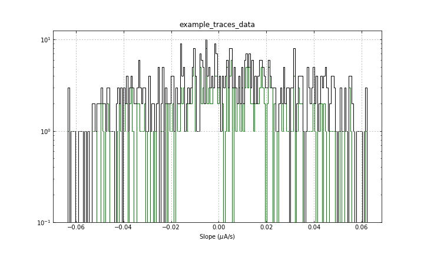

# Final Project README (PLEASE)
----
## Samuel Watkins, 3032132676

### 1. Introduction

This folder contains all of the pieces needed to run the DIDV analysis suite. This README explains what is in this folder, what I have done, and shows the results of the code to show that it runs. This README also includes the asked for **screen capture**.

### 2. Proposal

Below is the project proposal that I submitted on Piazza.

> **Final Project Proposal**

>My project proposal is to create an analysis suite for my research group. My group runs transition edge sensor (TES) detectors that operate in the superconducting transition, where the dynamics are nonlinear (but can be linearized in the small signal limit). The small signal dynamics can be used to study the physical properties of the detectors, as well as to calculate the expected energy resolution from theory (which would not be in the scope of this analysis). 

>The analysis suite will use an already written autocutting algorithm (to cut out data that has pulses from photons or other particles hitting the detector), fit the complex impedance of the detector in frequency space, and generate plots to show the results. If I have the time, I would also like to combine this analysis suite with one that processes the noise of a flat trace (i.e. calculates the power spectral density). I would also like to use parallel processing in this, since we can have up to ~1000 data files to analyze at a time.

>We have some of these functions written up for fitting, but my idea is to vastly clean up the code/improve the comments, consolidate the various sources into one analysis suite, add the parallel processing to hopefully speed up the code by a fair amount, create nice plots, and find a good way of saving the data that isn't .pkl files (I think this would be .hdf5). This would draw on lectures about Numpy/Scipy for the math/fitting functions, Matplotlib for the plotting, Parallelism for the parallel computing, and the databases with regards to using HDF5.

>Let me know if this sounds okay, or if any of you have other questions about it! Thanks!

### 3. Background of Code

The main code that was written is called `DIDV.py`. As explained in the proposal, this code is made to take in an array of traces from our detector (a transition edge sensor, or TES). These traces are essentially measurements of the current flowing through the TES. Since these sensors operate in the transition between normal and superconducting (hence the name), the resistance of the TES will depend on both changes in temperature and changes in current. We can understand this complex dependence in the small signal limit by fitting the response of the current through the TES to a square wave jitter in the voltage across it. As long as we know the resistance of the TES, as well as the resistance of the various electronics in the circuit, then we can determine what the complex admittance ($\partial I/\partial V) of the TES, which allows us to calculate many other aspects of the detector ($\partial I/\partial P$, the expected noise of the detector, the expected energy resolution of the detector, etc.).

### 4. What I've Done

What I have done is written a fitting routine that takes an array of traces, deconvolves the trace to get the measured $\partial I/ \partial V$, fits the complex admittance in frequency space to four different fitting models (a 1-pole model, a 2-pole model, a 3-pole model, and a 2-pole model that allows the use of prior knowledge of parameters), saves the results of the fit, and creates plots of the fit in time domain/frequency space, as well as some diagnostic plots (to see distributions of means, slopes, ranges, and skewnesses).

In this code, I save the data to an HDF5 file via h5py, use parallel processing to deconvolve the traces faster than serial, use matplotilb to create many plots, and use numpy and scipy extensively.

I have also taken auto-cutting code (`General.py`) and filtering (`Filtering.py`) code that already existed, cleaned up the documentation a little bit, and included the files in the repo, so that `DIDV.py` can use the codes to apply the auto cuts (when `autoCut = True`). I did not have the time to add the ability to process the noise of a flat trace, as mentioned in the proposal.

### 5. Testing the Code

As far as testing the code goes, the main function that does the processing is called `processDIDV`. This function has calls to every other function in the `DIDV.py` code. Thus, I only needed to set up a Jupyter Notebook that loaded an example dataset and called the `processDIDV` function (making sure that the `fit`, `autoCut`, and `makePlots` flags are set to True). The Jupyter Notebook I wrote the test in is called `test_didv.ipynb`. This notebook prints out the saved data and loads all of the saved plots into the notebook to quickly show that the fits were successful.

### 6. Results

The test script `test_didv.ipynb` shows that the fits were indeed successful. I have also showed the outputted plots below, to show that they work. Since a screen capture was requested, I've added screen captures below the outputted figures.

