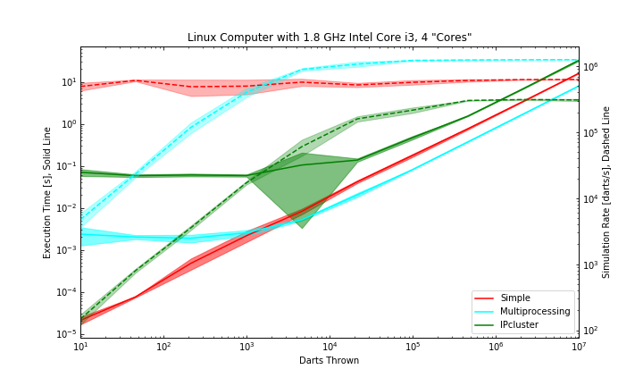

# HW 4 README

## Important:

Before running the code, make sure that you run the following line in command line.
```
ipcluster start -n 4
```
Otherwise, the iPyParallel section of the code will not work. When you are done running the code, feel free to stop ipcluster via `ctrl+C` in the command window.

## Outputted Plot



The above plot shows the behavior of each parallelization method as a function of the number of darts thrown. The computer being used is a Linux Computer with an Intel Core i3 CPU, which has 4 cores.

We can see that for a low amount of darts thrown, the simple serial method beats out both of the parallelization methods. This is due to the overhead that comes with starting these parallelization methods. 

We see that when we begin throwing many darts (above about 1,000 darts), then the Multiprocessing method starts beating out the simple serial method. This is because the ability of the parallelization to process many more darts thrown per second than the serial method beats out the time lost to overhead. 

Interestingly, we see that the IPcluster method is always the slowest method. I am unsure on why this is the case for my machine, as the plots in the homework show that the Multiprocessing and IPcluster converge to about the same values for large amounts of darts thrown. Unfortunately, I was unable to reproduce this behavior. Perhaps it is due to the relative slowness of my machine compared to the other computers shown in the homework.

It is worth noting that the above plot is the results of 10 simulations done for each number of darts in order to give means and standard deviations. The "bulge" at about 5000 darts in the IPcluster method is likely due to a large (slow) outlier.
