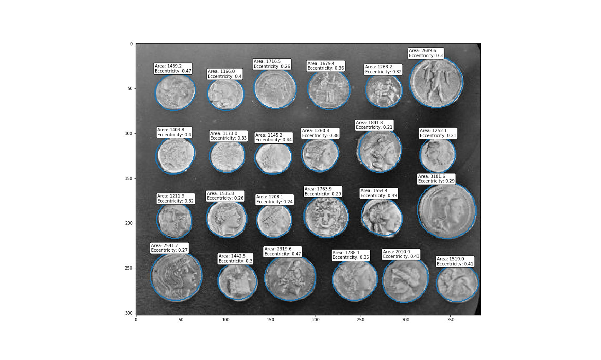
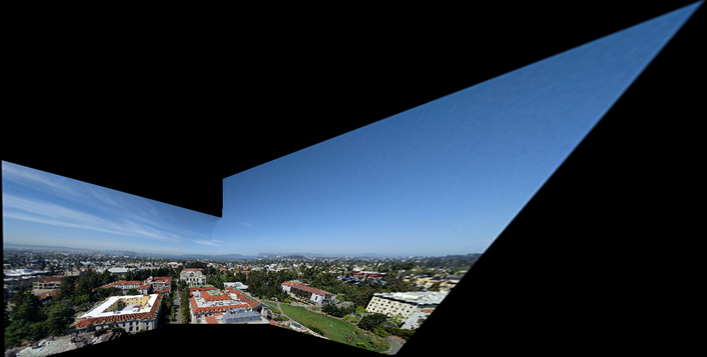

# HW 7 README

## Problem 1: Counting Objects

The first part of Homework 7 involves calculating the area and eccentricity of each ellipse that envelopes the coins in the built-in coins image. The result is shown below:

## Problem 2: Panorama Stitching

Although it wasn't required, I refactored the code to (theoretically) be able to handle an arbitrary number of images. I've kept most of the comments intact from the tutorial, adding some of my own when necessary. It seems to work well for 2 and 3 images. 

However, I've noticed a bug when using 4 images where the image furthest from the reference image will get cropped due to needing apply two warp transforms. The first warp transform transforms the image off of the page, which then crops the image. Thus, when the second warp transform brings the image to the correct offset, the image remains cropped. The application of transforms is a bit more nontrivial than I thought, and I have run out of time in diagnosing this bug. With this bug, the outputted panorama of 4 images essentially becomes a panorama of 3 images. I assume at 5+ images, the same behavior would occur. 

Note: the reference image must be manually chosen by the user, which can be done by setting the `ref_img` parameter to the index of the desired reference image. For my panorama, I have this set as `ref_img = 2`. This parameter can be found in the second code cell of problem 2, where we first load in the images.

The outputted panorama (which was taken from the top of the Campanile) is shown below:

